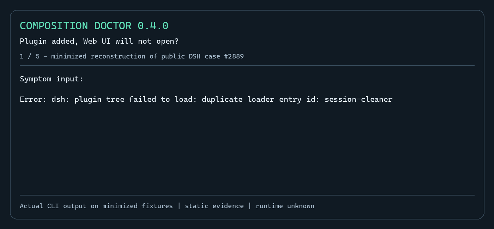
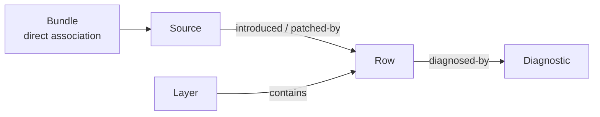

# dsh-composition-doctor

[](https://www.npmjs.com/package/dsh-composition-doctor)
[](https://github.com/lemonxiny55/dsh-composition-doctor/actions/workflows/ci.yml)
[](https://dsh-plugin.org/plugins/lemonxiny55/dsh-composition-doctor)

English | [中文](README.zh.md)

> **DSH won't start after installing or upgrading a plugin?**
>
> Composition Doctor 0.4.0 links supported failures to the bundle, patch or profile layer you should inspect next—even when the Web UI cannot open.

**Read-only · Offline diagnosis by default · No automatic repairs · Node.js ≥20**

## Quick start

[0.4.0 is published on npm](https://www.npmjs.com/package/dsh-composition-doctor/v/0.4.0). Install the standalone CLI, then select your actual profile directory:

```sh
npm install -g dsh-composition-doctor@0.4.0 --ignore-scripts
dsh-doctor --version
dsh-doctor check --profile "$HOME/.dsh/profiles/web"
```

The version command should print `0.4.0`. The profile path above works in Bash and PowerShell for the standard Web profile. For Desktop, select its actual profile directory (commonly `$HOME/.dsh/profiles/desktop`); custom DSH homes may differ. `--profile` accepts a **directory**, not the nickname `web` or `desktop`. CLI diagnosis needs no running DSH or host plugin installation. Installation downloads npm packages; subsequent default diagnosis works offline.

With a minimized error log:

```sh
dsh-doctor diagnose --profile "$HOME/.dsh/profiles/web" --log ./minimal-error.log
```

No log? `check` inspects the same supported metadata conditions. `unknown`, `no-match`, or exit 0 **does not mean the profile is healthy**. Missing layers and unobserved runtime stay unknown.

If global installation is inconvenient, use `npx --yes --package=dsh-composition-doctor@0.4.0 dsh-doctor check --profile "<actual-profile-directory>"` (downloads the package on first use). If the command is unavailable after global install, reopen your terminal or check npm's global bin path. A profile read error means you should verify the selected directory and access; it is not a plugin incompatibility diagnosis.

### See the failure paths in 25 seconds



This GIF renders actual output from the **published npm 0.4.0 CLI** on a minimized reconstruction of [public case #2889](https://github.com/deepseek-ai/deepseek-harness/discussions/2889). It is a fixture diagnosis, not a recording of the reporter's DSH runtime. Ordinary patch updates are not counted as duplicate insertions. [Static image and full output](docs/demo/README.md) · [Missing packaged patch example](docs/demo/missing-patch.png) · [Sources and boundaries](docs/failure-cases.md).

**Did it help you find a source? Did it return unknown?** [Share a short usage report](https://github.com/lemonxiny55/dsh-composition-doctor/issues/new?template=usage-report.md) with your next manual check. Reports are opt-in; there is no telemetry. If it helped, a Star or a recommendation to someone with the same problem helps others discover it.

### Optional Web Explorer

The CLI is enough to investigate a failed startup. For the report viewer in a working Web profile:

```sh
dsh plugin --profile web add dsh-composition-doctor@0.4.0
```

Restart the host, then use Settings → Composition Doctor. Desktop users should use its normal plugin manager and the npm spec `dsh-composition-doctor@0.4.0`. The viewer reads reports exported with an explicit `--report-dir`; see [report publishing](#reports-and-evidence-boundaries). Installing the host plugin and exporting a report are separate opt-in steps.

Pipes and structured output work too:

```sh
dsh web 2>&1 | dsh-doctor diagnose --profile ./web
dsh-doctor diagnose --profile ./web --log - --format json
dsh-doctor diagnose --profile ./web --format markdown
```

Default `diagnose`/`check` inspect static metadata without starting DSH, importing plugin code, running lifecycle scripts or accessing the network. `check` is a small alias for the same reader and requires the same explicit profile. JSON returns the versioned explanation result; `--output <dir>` or `--report-dir <dir>` writes a compatible analysis report with `failureExplanation` and `compositionFacts` plus Markdown. Output directories must be outside the profile. No report is written by default.

Then inspect a specific source:

```powershell
dsh-doctor why row tool-bash --profile C:\path\to\profile
dsh-doctor impact bundle @example/dsh-bundle --profile C:\path\to\profile
```

`why` explains one observed row and its source chain. `impact bundle` lists rows and diagnostics directly associated with that bundle source.



These links appear only when the report has supporting facts; missing ownership is left unknown.

## Real failure examples

1. **A bundle plus a hand-written insertion.** [DSH Discussion #2889](https://github.com/deepseek-ai/deepseek-harness/discussions/2889) reports a plugin-management change that promotes dependencies into the bundle list while manual rows remain. Doctor's minimized regression connects `session-cleaner` to both insertion paths. Review the bundle declaration and manual patch together; a patch update is never counted as a second insertion.
2. **A package without its declared patch file.** [DSH Discussion #6539](https://github.com/deepseek-ai/deepseek-harness/discussions/6539) includes a report of the published `dsh-cad` package lacking its YAML overlay. The minimized fixture produces:

```text
Bundle patch is unavailable: dsh-cad
reported-by-log; evidence: static

Path 1: bundle dsh-cad → <PROFILE>/node_modules/dsh-cad/package.json

Next: Review the bundle manifest → dsh.bundle.patch and packaged YAML file.
Doctor did not modify your profile.
```

These are sanitized reconstructions of public failure patterns, not copies of users' profiles or a replay of their runtime. The suite also verifies that the same logs with no matching metadata remain `unknown`.

## Supported explanations

| Pattern | Observable basis | Boundary |
|---|---|---|
| Duplicate loader id | Separate `insert`/base-row declarations, or duplicate composed rows | A normal update or patched source chain is not another insertion; no runtime rejection is inferred. |
| Bundle unavailable | Declared bundle plus bounded local resolution finding | Built-in installation bundles and external links may resolve elsewhere. |
| Missing/invalid bundle patch | Manifest plus missing, invalid or disallowed declared YAML metadata | No file or command suggested by a log is followed. |
| Patch target missing | Target declaration with no local insertion, or a public dump finding | Home/CLI/built-in layers may still supply it. |
| Peer/version mismatch | Installed DSH-family peer range and independently selected `--dsh-version <exact>`; Node engine uses the actual Doctor process | Log-reported versions are not runtime facts; no compatible release is guessed. |
| Config replacement / override | Config patch declaration or composed provenance/replacement fact | Removed effective keys and field ownership stay unknown unless observed. |

Upgrade ownership changes use existing `snapshot`/`diff` and `preflight`; arbitrary route/slot/hook root causes are outside this version's failure patterns. `diagnose --composed` opts in to the existing isolated public dump adapter; it never installs packages, starts plugin runtime, or upgrades static declarations to composed evidence. Copied-profile/provider coverage can be incomplete, and runtime remains `not-observed`.

Logs are limited to 1 MiB; explicit files must be `.log`, `.txt` or `.out`. Secret, workspace, session and chat paths are refused. At most 32 log signatures and 50 metadata explanations are retained; truncation is indicated in JSON. Human output shows the first three explanations. Exit 0 means a report was produced (including `unknown`/`no-match`), not that DSH is healthy; operational failures return 1 and invalid arguments return 2.

[Commands](#what-it-explains) · [Evidence boundaries](#reports-and-evidence-boundaries) · [Safety & privacy](#safety-and-privacy) · [Compatibility](#support-and-limitations) · [Development](#development)

## What it explains

| Command | Purpose |
|---|---|
| `dsh-doctor diagnose` | Explain supported failures from selected metadata, optionally focused by an untrusted error log. Human-readable by default; JSON/Markdown are available. |
| `dsh-doctor check` | Inspect the explicitly selected profile with the same bounded reader and show how to diagnose a symptom. |
| `dsh-doctor scan` | Detect duplicate Cordis rows, hook-order risks, UI slot/route ownership conflicts, bundle overrides, peer/platform mismatches, and profile drift. |
| `dsh-doctor snapshot` | Create a redacted, comparable profile snapshot with lockfile hashes. |
| `dsh-doctor diff` | Summarize added/removed/upgraded plugins, rows, hooks, UI claims, peers, and platforms. |
| `dsh-doctor preflight` | Rehearse a target DSH upgrade in an isolated temporary profile. |
| `dsh-doctor why row <id>` | Explain one row from an explicitly selected profile using observed source/layer facts. |
| `dsh-doctor impact bundle <name>` | List rows and diagnostics directly associated with an observed bundle source. |

The `why` and `impact` commands require `--profile <dir>`. Reports include an optional, versioned, redacted `compositionFacts` section shared by these commands and the Web Composition Explorer. The Web Settings page remains display/export only: it reads the latest local report, shows diagnostic and composition graphs, and exports JSON/Markdown. It has no repair, install, or uninstall action.

Composition facts describe the structure returned by the public `--dump-config` command or static declarations when that is unavailable. `introduced` and `patched-by` edges describe the source chain recorded by DSH; they do not prove per-field ownership. If earlier config keys are not available, removed keys and field owners remain unknown. Route/slot ownership, runtime hook ownership, arbitrary dependencies, and possible dependents are reported as not observed/not modelled.

## Reports and evidence boundaries

`scan --output <dir>` writes only to the requested directory. To make the same report visible to the read-only Settings page, opt in explicitly: `--publish` copies it to the default plugin directory `.dsh-composition-doctor/reports`, while `--report-dir <dir>` publishes to a configured plugin directory. Use `--format both` so the Web route has `report.json` and Markdown remains exportable. Do not use a profile directory, `.env` location, or any directory containing keys, tokens, or other secrets as a report directory.

Reports declare `evidenceMode`: `static` means allow-listed manifest/patch/package metadata only; `composed` means a public `dsh --profile <name> --dump-config` command returned a composition result; `runtime-observed` is reserved for a successful isolated runtime observation backend; and `mixed` is reserved for an adapter that supplies both. `dump-config` never proves runtime execution, including when a `!!js` or other runtime-dependent value is present. Static findings and bounded metadata coverage are not proof of the final runtime composition. If no compatible public DSH CLI is available, scan falls back to static and records a warning. Reports written before evidence schema 2 may still be read as legacy `resolved`, but new reports never emit that label.

`preflight --candidate package@version` records a validated exact reference in an isolated temporary `package.json`. Target artifact discovery is local-first (`--dsh-bin`, package directory, tarball, installed `dsh`, `--package-manager-cache`, then Doctor-owned cache); registry access is allowed only with explicit `--online`. Online resolution downloads exact registry tarballs into Doctor-owned cache, records source/version/integrity/hash, and never installs or runs lifecycle scripts. `--allow-build` does not grant permission to execute third-party runtime code.

`scan --fail-on never|info|warning|error` controls the scan exit code. The default is `never`: warnings and errors remain in the report without changing the exit code. `info` fails on any diagnostic, `warning` fails on warnings or errors, and `error` fails only on errors. Malformed arguments return exit code 2; operational failures return 1.

After changing a profile, restart the Web UI (`npx @deepseek-ai/dsh web`) before scanning it again.

Each finding is `info`, `warning`, or `error` and includes evidence, explanation, and the smallest remediation. `runtimeSmoke.status=not-run` is not a runtime PASS; `artifact-unavailable` is not `incompatible`; and a warning is not a confirmed failure.

## More commands

```powershell
dsh-doctor scan --profile C:\path\to\profile --format both --output .\reports\profile --publish
dsh-doctor scan --profile C:\path\to\profile --format both --output .\reports\archive --report-dir C:\safe\doctor-reports
dsh-doctor snapshot --profile C:\path\to\profile --output .\reports\before.json
dsh-doctor diff --before .\reports\before.json --after .\reports\after.json --format both
dsh-doctor preflight --profile C:\path\to\profile --target-dsh 0.1.5-rc.2
```

## Safety and privacy

Default operations are read-only or isolated under the OS temporary directory. The plugin does not modify profiles, install/remove plugins, migrate configuration, escalate permissions, or perform network I/O by default. It never reads `.env`, profile secrets, session bodies, or workspace file contents, and does not collect or persist arbitrary environment-variable values. Public CLI execution receives only the minimal process-routing variables required by the host platform.

## Support and limitations

Doctor requires Node.js `>=20`. The release checks cover Windows/Ubuntu × Node 20/22/24, including packed fresh-install smoke; the real DSH `0.2.0-rc.2` public `--version`/`--dump-config` harness passed on the Node 24 jobs. The prior Desktop audit covers installation, report UI/export and disable/re-enable cold starts specifically on **DSH Desktop 0.2.0-rc.2 / Windows 11**. These checks do not verify arbitrary third-party runtimes or every host. On 2026-10-09, DSH npm `latest` remains `0.2.0-rc.2`; `0.2.1-alpha.2` is unverified here. Older `0.1.5-rc.1`/`rc.2` goldens remain historical evidence. [Compatibility detail](docs/compatibility.md) · [Published release evidence](docs/release-evidence/0.4.0-published.md) · [Final-main release CI](https://github.com/lemonxiny55/dsh-composition-doctor/actions/runs/37253989774).

## Development

```powershell
pnpm test
pnpm typecheck
pnpm build
pnpm pack
pnpm smoke:pack ./dsh-composition-doctor-0.4.0.tgz
```

Install checkout dependencies with `pnpm install --frozen-lockfile` before the development commands.

For checkout-only development, run the CLI with `node dist/cli/main.js` after building.

See [`README.zh.md`](README.zh.md), [`docs/compatibility.md`](docs/compatibility.md), and [`docs/examples/scan-report.md`](docs/examples/scan-report.md). MIT licensed.
