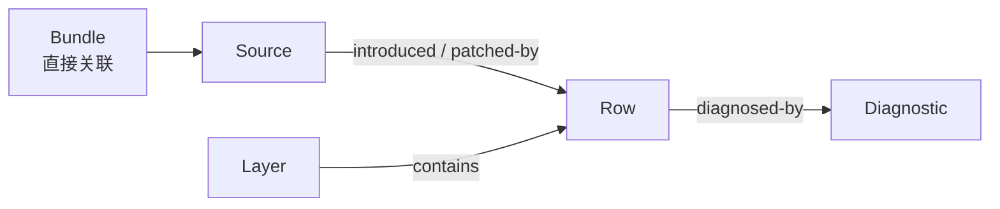

# dsh-composition-doctor（中文）

[](https://www.npmjs.com/package/dsh-composition-doctor)
[](https://github.com/lemonxiny55/dsh-composition-doctor/actions/workflows/ci.yml)
[](https://dsh-plugin.org/plugins/lemonxiny55/dsh-composition-doctor)

[English](README.md) | 中文

> **安装或升级插件后，DSH 启动失败了？**
>
> 找出涉及哪个 bundle、profile layer 或 override，并看清现有证据究竟能证明什么。

```sh
dsh-doctor diagnose --profile ./web --log dsh-error.log
```

```text
Duplicate loader entry id: session-cleaner
reported-by-log; evidence: static

Cause: session-cleaner is introduced by 2 separate loader declarations.

Path 1: bundle session-cleaner → <PROFILE>/node_modules/session-cleaner/cordis.patch.yml
  layer: dsh.profile.bundles[0]: session-cleaner → row: session-cleaner
Path 2: cordis.patch.yml
  layer: cordis.patch.yml → row: session-cleaner

Unknown: runtime not observed / not-run; final composition unknown.
Doctor did not modify your profile.
```

来自最小化的[公开重复加载案例](https://github.com/deepseek-ai/deepseek-harness/discussions/2889)的输出摘录。静态声明能指出冲突路径，不能证明 runtime 已崩溃。[完整 Demo 与来源](docs/failure-cases.md) · [25 秒终端 Demo](scripts/failure-demo.mjs)

**解释故障 · 追踪组合来源 · 预检升级风险**

**只读 · 默认离线 · 不自动修复或安装**

面向 [DeepSeek Harness](https://github.com/deepseek-ai/deepseek-harness)（`dsh`）。一条命令把已支持的故障关联到实体、可观察的来源路径和人工下一步；没有证据的部分保留 unknown。

## 快速开始

**0.4.0 目前为本地 RC，尚未发布。** 公开的 0.3.0 没有 `diagnose`。请从本 checkout 构建，并安装审查后的本地 tarball：

```sh
pnpm install --frozen-lockfile
pnpm build
pnpm pack
pnpm add -g ./dsh-composition-doctor-0.4.0.tgz --ignore-scripts
dsh-doctor check --profile ./web
dsh-doctor diagnose --profile ./web --log dsh-error.log
```

`--profile` 接受明确的目录，而不是 DSH profile 昵称。标准 Web profile 可使用 `~/.dsh/profiles/web`，PowerShell 中使用 `$HOME/.dsh/profiles/web`。CLI 不需要 Web UI 正常启动，也不需要安装 host 插件。需要 Web Explorer 时，通过 DSH plugin 命令添加审查后的本地 tarball，再显式导出到插件配置的 Doctor 报告目录。

支持管道和结构化输出：

```sh
dsh web 2>&1 | dsh-doctor diagnose --profile ./web
dsh-doctor diagnose --profile ./web --log - --format json
dsh-doctor diagnose --profile ./web --format markdown
```

默认 `diagnose`/`check` 只读取静态元数据，不启动 DSH、不导入插件代码、不执行 lifecycle script、不访问网络。`check` 是复用相同 reader 的极简别名，同样需要明确指定 profile。JSON 返回版本化的 explanation；`--output <目录>` 或 `--report-dir <目录>` 写入含 `failureExplanation` 和 `compositionFacts` 的兼容分析报告及 Markdown。输出目录必须位于 profile 外；默认不写报告。

继续追踪具体来源：

```powershell
dsh-doctor why row tool-bash --profile C:\path\to\profile
dsh-doctor impact bundle @example/dsh-bundle --profile C:\path\to\profile
```

`why` 解释一个可观察 row 的来源链；`impact bundle` 列出有直接 source 关联证据的 rows 和 diagnostics。



只有报告中存在支持 facts 时才展示这些关系；没有 ownership 证据的部分仍标为 unknown。

## 真实故障案例

1. **bundle 与手写 insert 重复加载。** [DSH Discussion #2889](https://github.com/deepseek-ai/deepseek-harness/discussions/2889) 报告了插件管理把依赖加入 bundle 列表，而旧手写 row 仍然存在的情况。最小化回归把 `session-cleaner` 关联到两条 insert 路径。应一起检查 bundle 声明和手写 patch；普通 patch update 不会被算成第二次引入。
2. **已安装包缺少它声明的 patch。** [DSH Discussion #6539](https://github.com/deepseek-ai/deepseek-harness/discussions/6539) 的评论报告了 npm `dsh-cad` 缺少 YAML overlay。最小化 fixture 的输出摘录：

```text
Bundle patch is unavailable: dsh-cad
reported-by-log; evidence: static

Path 1: bundle dsh-cad → <PROFILE>/node_modules/dsh-cad/package.json

Next: Review the bundle manifest → dsh.bundle.patch and packaged YAML file.
Doctor did not modify your profile.
```

这些是公开故障模式的脱敏结构重建，不是用户 profile 原件，也不声称重放了现场 runtime。同一日志缺少匹配元数据时，测试要求返回 `unknown`。

## 支持的解释

| 模式 | 可观察依据 | 边界 |
|---|---|---|
| duplicate loader id | 独立 insert/base-row 声明，或 composed tree 中重复 row | 普通 update、patched source chain 不算第二次插入，不推断 runtime 已拒绝。 |
| bundle 不可解析 | profile 声明及有边界的本地解析 finding | 安装级内置 bundle、外部 link 可能在其他位置可解析。 |
| bundle patch 缺失/无效 | manifest 与缺失、无效或不允许读取的 YAML | 不跟随日志建议的文件或命令。 |
| patch target 缺失 | patch target 没有本地 insert，或公开 dump finding | home/CLI/内置 layer 可能仍提供该 row。 |
| peer/version 不兼容 | 已安装 DSH-family peer range 与独立指定的 `--dsh-version <精确版本>`；Node engine 使用 Doctor 当前进程版本 | 日志中的版本不是 runtime fact，不猜测可用插件版本。 |
| config replacement/override | config patch 声明、composed provenance/replacement fact | 未观察到的有效键丢失、字段 owner 保持 unknown。 |

升级后的 ownership 变化继续通过 `snapshot`/`diff`、`preflight` 检查；任意 route/slot/hook 根因不进入本版 pattern。`diagnose --composed` 显式启用既有的隔离公开 dump adapter，不安装包、不启动插件 runtime、不把静态声明升级为 composed evidence。复制 profile/provider 的覆盖可能不完整，runtime 仍是 `not-observed`。

日志限制 1 MiB；显式文件只接受 `.log`、`.txt`、`.out`，拒绝 secret、workspace、session、chat 路径。最多保留 32 个日志 signature 和 50 条元数据解释；JSON 标明截断，人类输出默认显示前三条。退出 0 表示生成了报告，包括 `unknown`/`no-match`，不表示 DSH 健康；执行失败返回 1，参数错误返回 2。

[命令能力](#模型可解释什么) · [证据边界](#报告与证据边界) · [安全与隐私](#安全与隐私) · [兼容范围](#支持范围与限制) · [开发](#开发)

## 模型可解释什么

| 命令 | 作用 |
|---|---|
| `dsh-doctor diagnose` | 从明确选择的元数据解释支持的故障，可用不可信日志聚焦。默认人类可读，支持 JSON/Markdown。 |
| `dsh-doctor check` | 使用同一有边界的 reader 检查明确指定的 profile，并提示如何进一步 diagnose。 |
| `dsh-doctor scan` | 检测重复 Cordis row、hook 顺序风险、UI slot/route 所有权冲突、bundle 覆盖、peer/platform 不匹配和 profile 漂移。 |
| `dsh-doctor snapshot` | 生成脱敏、可比较的 profile 快照及 lockfile 哈希。 |
| `dsh-doctor diff` | 汇总新增、删除或升级的插件，以及 rows、hooks、UI 声明、peer 和平台变化。 |
| `dsh-doctor preflight` | 在独立临时 profile 中演练目标 DSH 升级。 |
| `dsh-doctor why row <id>` | 基于明确指定的 profile 中可观察的来源和 layer 信息解释一个 row。 |
| `dsh-doctor impact bundle <name>` | 列出有直接来源关联证据的 bundle rows 和 diagnostics。 |

`why` 和 `impact` 都需要 `--profile <目录>`。报告新增可选、版本化且脱敏的 `compositionFacts`，由这两个命令和 Web Composition Explorer 共用。Web Settings 仍然只读：它读取最新本地报告，展示诊断图和 composition 图，并导出 JSON/Markdown；不提供修复、安装或卸载操作。

Composition facts 描述公开 `--dump-config` 返回的结构；无法取得时仅描述静态声明。`introduced` 和 `patched-by` 表示 DSH 输出中记录的来源链，不证明逐字段 owner。若未观察到前层 config key，移除的键和字段 owner 必须是 unknown。route/slot ownership、runtime hook ownership、任意依赖和可能的 dependents 会标记为未观察/未建模。

## 报告与证据边界

`scan --output <目录>` 只写入显式指定的目录。要让只读 Settings 页面看到同一份报告，必须显式选择 `--publish`，它会复制到默认插件目录 `.dsh-composition-doctor/reports`；也可以使用 `--report-dir <目录>` 发布到配置的插件报告目录。请使用 `--format both`，使 Web route 能读取 `report.json`，同时保留 Markdown 导出。报告目录不能是 profile、`.env` 所在位置，或任何含密钥、token 或其他敏感信息的目录。

报告中的 `evidenceMode` 标明证据来源：`static` 仅表示 allow-list 中的 manifest、patch、package metadata 等静态证据；`composed` 表示公开 `dsh --profile <name> --dump-config` 返回了 composition 结果；`runtime-observed` 只允许真正启动隔离 runtime 并观察到注册/行为的后端使用；`mixed` 预留给同时提供多类来源的适配器。`dump-config` 即使成功，也不代表 runtime 已验证；存在 `!!js` 等运行时依赖时尤其如此。找不到兼容的公开 DSH CLI 时会回退到 static，并明确报告 warning。旧的 evidence schema 2 之前报告仍可按 legacy `resolved` 读取，但新报告不会再输出该标签。

`preflight --candidate package@version` 只会把通过校验的精确引用记录到隔离临时 `package.json`。目标 artifact 默认按本地优先顺序查找：`--dsh-bin`、本地 package directory、本地 tarball、已安装 `dsh`、`--package-manager-cache`、Doctor 自己的 cache；只有显式 `--online` 才允许访问 registry。在线解析会把精确 tarball 写入 Doctor 自己的 cache，记录来源、版本、integrity 和 hash，并且不会安装或执行 lifecycle script。`--allow-build` 不等于允许执行第三方 runtime code。

`scan --fail-on never|info|warning|error` 控制 scan 的退出码。默认是 `never`：warning 和 error 会写入报告，但不改变退出码；`info` 遇到任意诊断时退出 1，`warning` 遇到 warning 或 error 时退出 1，`error` 只在 error 时退出 1。参数错误退出 2，执行失败退出 1。

更改 profile 后重启 Web UI（`npx @deepseek-ai/dsh web`），再重新扫描。

每条诊断均为 `info`、`warning` 或 `error`，并附带 evidence、explanation 和最小 remediation。`runtimeSmoke.status=not-run` 不等于 runtime PASS；`artifact-unavailable` 不等于 `incompatible`；warning 也不等于已确认失败。

## 更多命令

```powershell
dsh-doctor scan --profile C:\path\to\profile --format both --output .\reports\profile --publish
dsh-doctor scan --profile C:\path\to\profile --format both --output .\reports\archive --report-dir C:\safe\doctor-reports
dsh-doctor snapshot --profile C:\path\to\profile --output .\reports\before.json
dsh-doctor diff --before .\reports\before.json --after .\reports\after.json --format both
dsh-doctor preflight --profile C:\path\to\profile --target-dsh 0.1.5-rc.2
```

## 安全与隐私

默认操作只读，或仅在操作系统临时目录中隔离运行。插件不会修改 profile、安装或删除插件、迁移配置、扩大权限，默认也不会执行网络 I/O。它不会读取 `.env`、profile 密钥、会话正文或工作区源文件内容，也不会收集或持久化任意环境变量值；启动公开 CLI 时只传递平台所需的最小进程路由变量。

## 支持范围与限制

2026-10-03 核对的 npm `latest` 为 `@deepseek-ai/dsh@0.2.0-rc.2`，已在 Windows 和 Ubuntu 24.04（WSL）+ Node.js 24.19.0 重新运行公开 `--version`/`--dump-config` harness。Doctor 的完整 RC 门槛与 packed fresh-install smoke 已在本地 Windows/Node 24、Ubuntu/Node 20.19.5 和 24.19.0 通过。2026-10-04，[Hosted CI 的 Windows/Ubuntu × Node 20/22/24 共六个作业全部通过](https://github.com/lemonxiny55/dsh-composition-doctor/actions/runs/37187050083)，包含 packed fresh-install smoke；两个 Node 24 作业均通过当前 DSH 公开 harness。`0.1.5-rc.1`/`rc.2` golden 仅作历史证据，没有 artifact 的测试会 skip。`0.2.1-alpha.1` 属于 expected-compatible/experimental，未验证。Doctor 支持 Node.js `>=20`。此声明不代表任意第三方插件可用，也不代表观察过插件 runtime/UI 注册。[兼容性细节](docs/compatibility.md) · [RC 验证记录](docs/release-evidence/0.4.0.md)。

## 开发

```powershell
pnpm test
pnpm typecheck
pnpm build
pnpm pack
pnpm smoke:pack ./dsh-composition-doctor-0.4.0.tgz
```

仅在 checkout 开发时，构建完成后使用 `node dist/cli/main.js` 运行 CLI。

参阅 [`README.md`](README.md)、[`docs/compatibility.md`](docs/compatibility.md) 和 [`docs/examples/scan-report.md`](docs/examples/scan-report.md)。MIT 许可。
